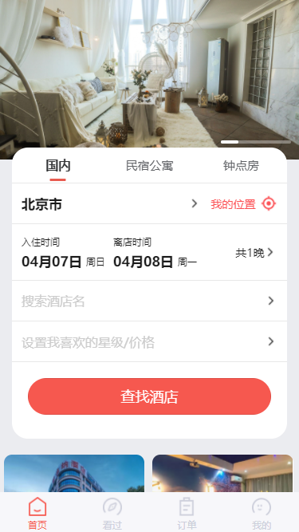
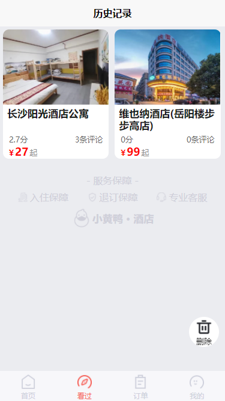
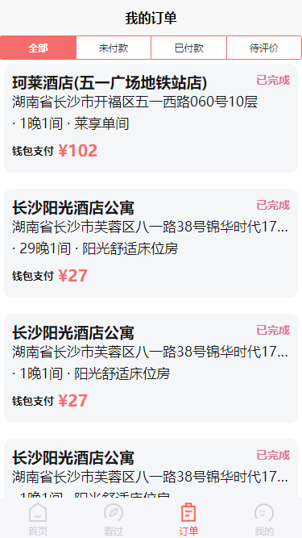
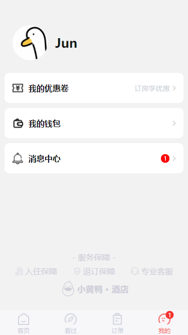

# 小黄鸭酒店

该项目包含数据库,uniapp用户端,node.js后端代码

后期会加上SpringBoot+vue的后台管理系统

## 页面展示

### 首页

### 酒店详情

### 看过

### 订单页面

### 我的

## 功能介绍

### 1.酒店筛选

对酒店的所属类型,所在城市,酒店名称,星级,价格进行筛选

### 2.查看酒店详情

对酒店图片,评价,星级,地址,服务,拥有房型进行展示

### 3.房间详情

对房型的名称,服务,价格进行展示

### 4.入住时间

可以通过弹出日历选择具体的入住时间以及离店时间

### 5.订购酒店

选择订购房间后填写房间数,入住人,联系电话,即可通过钱包余额进行订单的支付

### 6.注册/登录

通过输入手机号码,密码进行注册,注册后可通过该账户进行登录

### 7.浏览记录

展示最近所查看的酒店

### 8.查看订单详情

可以查看或修改订单的状态,包括未付款,已付款,待评价,已完成四种状态,并展示该订单的订单号,酒店信息,入住时间,房间信息,入住人信息,在此页面可以再次预定该酒店或删除订单信息

### 9.优惠卷

展示用户所拥有的优惠卷,包括优惠金额,名称,有效期,起始金额,优惠卷描述,在订购酒店时可以进行相对应的折扣

### 10.钱包管理/钱包充值

可以查看钱包的余额,订购酒店可以使用钱包余额进行付款,使用充值码可以进行充值

### 11.查看公告

展示管理员或商家向用户所发送的公告,包含标题,作者,发送时间,内容

### 12.发送公告/充值码

管理员可以一键向所有用户发送公告或发送不重复的充值码,充值金额可自定义

### 13.订单评价

用户可以对已完成的订单进行评价,包括评价内容,上传图片,评分

### 14.充值码验证

对用户输入的充值码进行验证,判断其是否合法,并且未使用

### 15.评价

在酒店详情页面展示评价总数,平均评分,可以进入查看评价列表包括用户的头像,名称,评价内容以及评价时上传的图片

### 16.智能客服(0.2新增)

在我的页面添加了客服选项,通过调用chatgpt实现智能酒店介绍,需要自备apiKey,在main.js修改

## 部署

1.将hotelAPP_Server目录下的hotel_db.sql数据库导入

2.在hotelAPP_Server目录下打开cmd运行npm run start

3.将hotelAPP导入HBuilderX

后端数据库配置文件在hotelAPP_Server\db\sql.js修改
